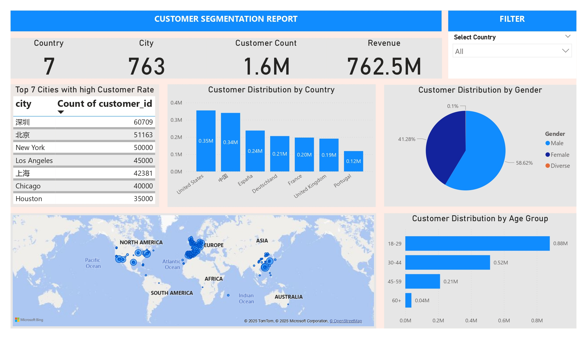
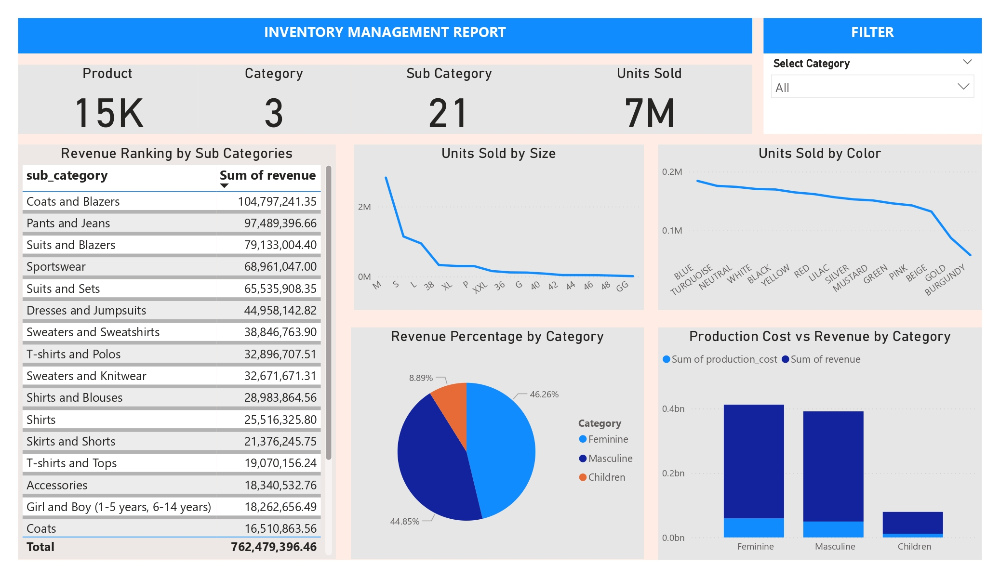
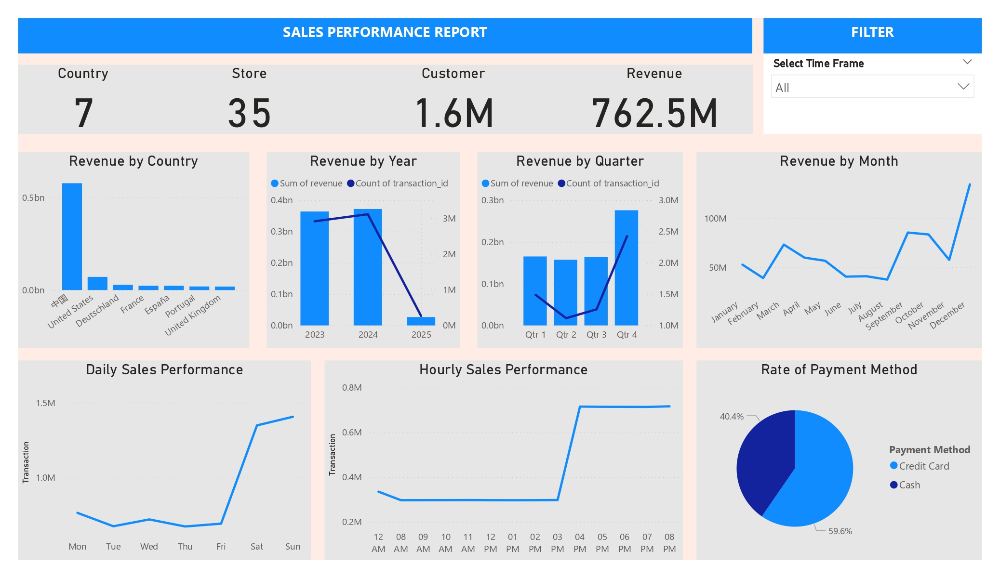
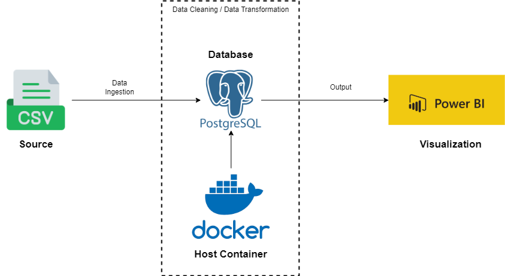
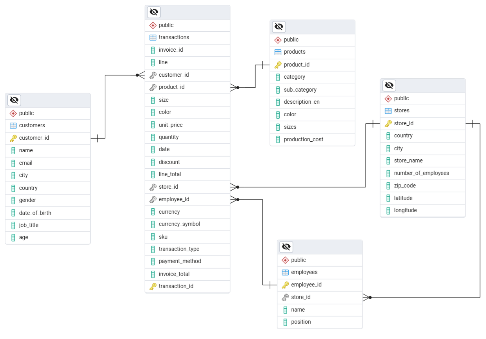

  
  

🛍️ **Fashion Retail Sales Report**

📌 **Overview**

This project focuses on analyzing fashion retail sales data to uncover customer trends, inventory performance, and sales insights.
The main goals are:

To integrate raw CSV data into a PostgreSQL database using Docker containers.

To design a data schema that supports efficient storage and querying.

To visualize insights in Power BI dashboards for better business decision-making.

This project solves the problem of fragmented retail data by creating a structured pipeline for data ingestion, transformation, and visualization, enabling businesses to make data-driven decisions in areas like customer segmentation, inventory optimization, and sales performance.

📊 **Dataset, Database & Data Schema**

🔹 **Dataset**

The dataset contains retail transaction data including:

Customers: demographics, city, country, gender, age.

Products: categories, sub-categories, size, color, production cost.

Transactions: purchases with invoice details, unit price, discount, payment method.

Stores & Employees: store locations, employee information.

🔹 **Database**

PostgreSQL hosted in a Docker container.

Data ingested from CSV files and cleaned before loading.

Used for performing transformations and serving data for BI dashboards.

🔹 **Data Schema (ERD)**

The schema is designed with four main tables:

customers – customer demographics.

products – product catalog details.

transactions – transaction-level details (linked to customer, product, store, employee).

stores & employees – store and employee information.

This relational schema enables efficient joins and aggregations to support reporting.

(Refer to the ERD diagram in the repo for details.)

📈 **Insights from Dashboards**

Three Power BI dashboards were created to provide business insights:

1️⃣ **Customer Segmentation Report**

Customer base: 1.6M customers across 7 countries and 763 cities.

Top cities: Shenzhen, Beijing, New York lead in customer count.

Demographics:

Majority male (58.62%).

Largest age group: 18–29 years old (0.88M customers).

Geographic distribution highlights strong markets in US and China.

2️⃣ **Inventory Management Report**

Revenue breakdown by product sub-category:

Top contributors: Coats & Blazers, Pants & Jeans, Suits.

Category revenue share:

Feminine (46.26%), Masculine (44.85%), Children (8.89%).

Units sold analysis: smaller sizes (S, M) dominate.

Production cost vs revenue: feminine and masculine categories generate the highest margins.

3️⃣ **Sales Performance Report**

Revenue by country: US leads, followed by China.

Yearly trends: steady growth in 2023–2024, slight dip in 2025.

Quarterly & monthly breakdowns: peak in Q4 and December, driven by seasonal demand.

Daily & hourly performance: weekends and evenings drive higher transactions.

Payment methods: Credit card (59.6%) preferred over cash (40.4%).

🛠️ **Tech Stack**

Data Source: CSV files

Database: PostgreSQL (Docker containerized)

Visualization: Power BI

Pipeline: Data ingestion → Database transformation → BI dashboard reporting
